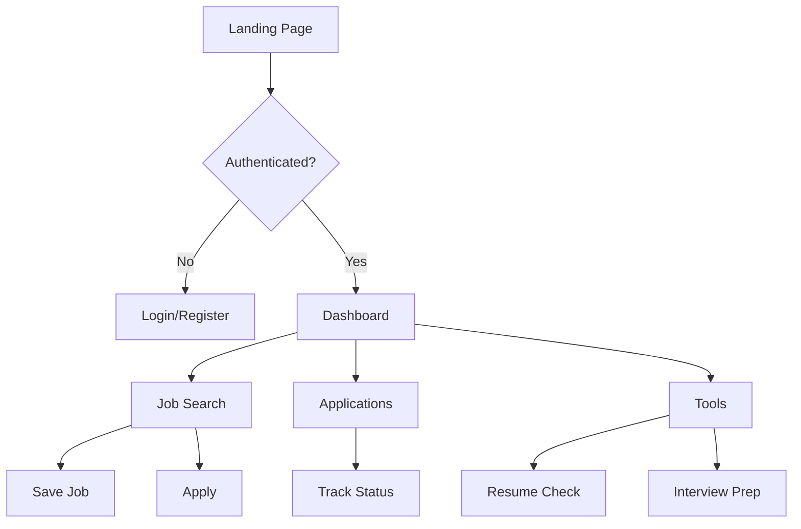
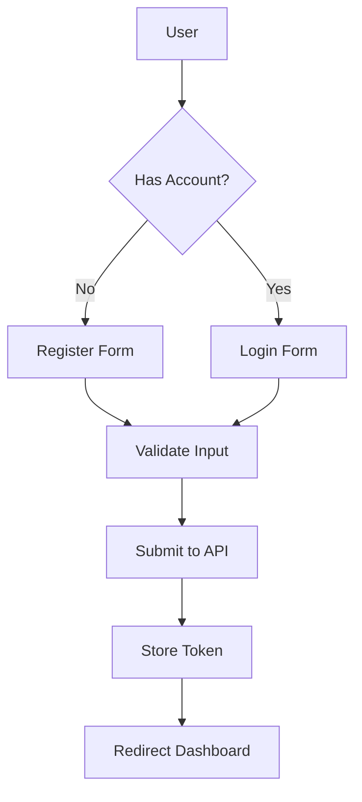
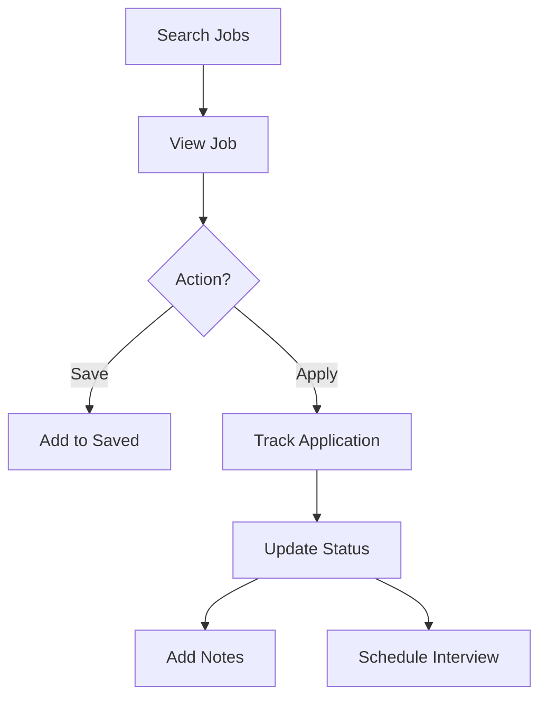
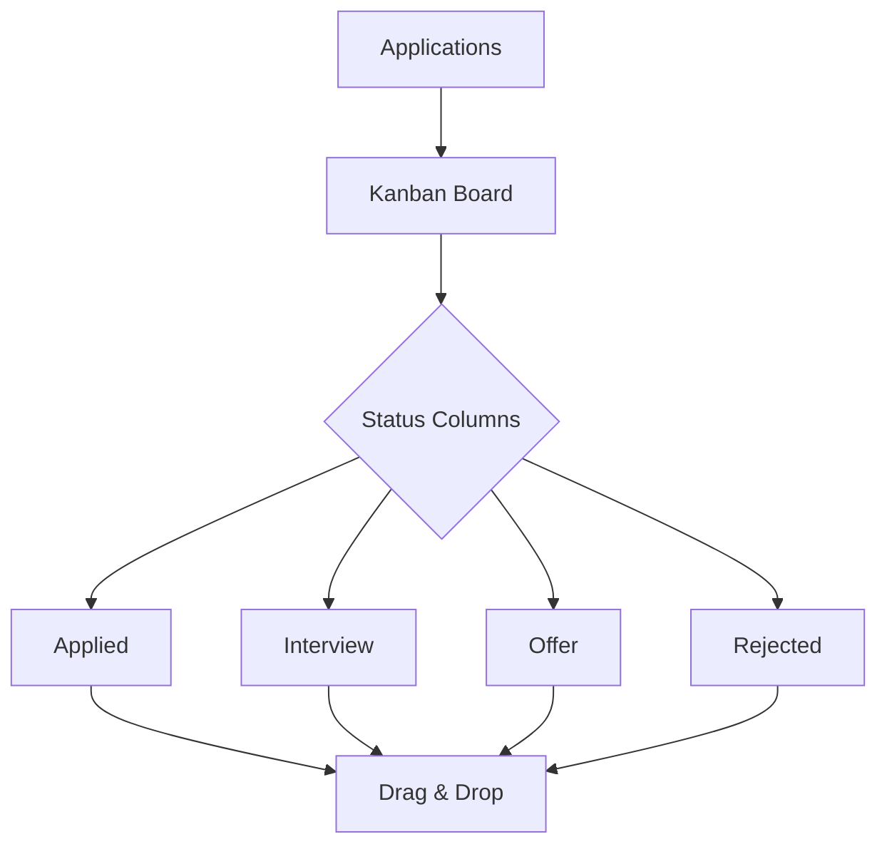
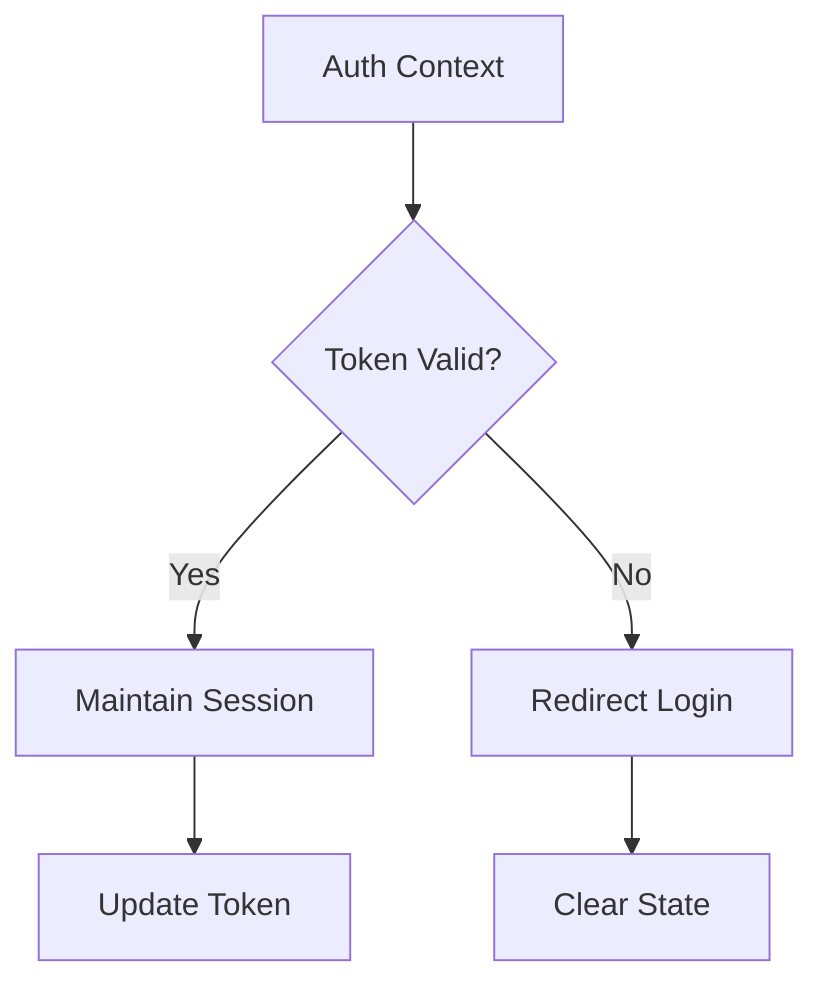
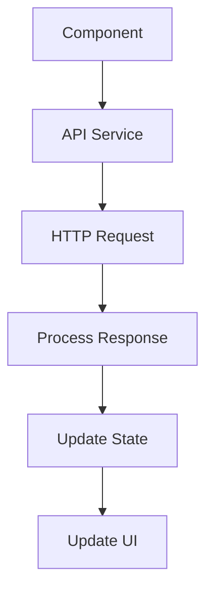

# Job Tracker Frontend

A React application for tracking job applications, analyzing resumes, and preparing for interviews.

## Features

- Job Search & Tracking
- Kanban Board for Application Status
- Resume ATS Analysis
- AI-Powered Interview Preparation
- Document Management
- User Authentication

## Tech Stack

- React 18
- Vite
- Tailwind CSS
- React Query
- React Router DOM
- React Beautiful DND
- Lucide React Icons

## Prerequisites

- Node.js 16 or higher
- npm or yarn
- Backend API running

## Setup & Installation

1. Clone the repository:
```bash
git clone <repository-url>
cd job-tracker/frontend
```

2. Install dependencies:
```bash
npm install
```

3. Create .env file:
```env
VITE_API_URL=http://localhost:8080/api
```

4. Run development server:
```bash
npm run dev
```

## Application Flow

### 1. User Journey


### 2. Authentication Flow


### 3. Job Application Flow


### 4. Kanban Board Flow


## Component Interaction Flow

### 1. Dashboard
1. Initial Load:
   ```
   Auth Check → Fetch Stats → Load Recent → Display
   ```

2. Data Updates:
   ```
   Action → Update API → Refetch Data → Update UI
   ```

### 2. Job Search
1. Search Process:
   ```
   Input → API Request → Process Results → Display
   ```

2. Application Tracking:
   ```
   Apply → Create Record → Update Board → Notify
   ```

### 3. Resume Analysis
1. Upload Flow:
   ```
   Select File → Extract → Send to API → Show Results
   ```

2. Analysis Process:
   ```
   Content → AI Analysis → Format Results → Display
   ```

### 4. Interview Preparation
1. Generation Flow:
   ```
   Job Details → Send Request → Process Response → Show Questions
   ```

2. Practice Flow:
   ```
   Select Question → Show Answer → Track Progress
   ```

## State Management Flow

### 1. Authentication State


### 2. Application State
1. Global State:
   - User information
   - Authentication status
   - Application settings

2. Local State:
   - Form inputs
   - UI controls
   - Temporary data

### 3. Query State:
   - Cached API responses
   - Loading states
   - Error states

## User Interface Flow

### 1. Navigation
```
Dashboard → Job Search → Applications → Tools
```

### 2. Job Application Process
```
Search → View → Apply → Track → Update
```

### 3. Tool Usage
```
Select Tool → Input Data → Process → View Results
```

## Data Flow

### 1. API Integration


### 2. State Updates
```
Action → API Call → Update Cache → Refresh UI
```

### 3. Error Handling
```
Error → Toast Notification → Recovery Option
```

## Feature Integration

### 1. Document Processing
1. Upload:
   ```
   Select → Validate → Upload → Process
   ```

2. Management:
   ```
   List → View → Edit → Update
   ```

### 2. AI Features
1. Resume Analysis:
   ```
   Upload → Process → Display Results
   ```

2. Interview Prep:
   ```
   Input Details → Generate → Show Materials
   ```

## Real-time Updates
1. Kanban Board:
   - Drag and drop updates
   - Status changes
   - New applications

2. Dashboard:
   - Statistics updates
   - Recent activities
   - Notifications

## Error Handling
1. Input Validation
2. API Error Recovery
3. Network Status
4. Loading States
5. User Feedback

## Available Scripts

```bash
# Development
npm run dev

# Build
npm run build

# Preview production build
npm run preview

# Run tests
npm test

# Run tests with coverage
npm test -- --coverage

# Lint code
npm run lint

# Format code
npm run format
```

## Components

### Authentication
- Login
- Register
- Protected Route Wrapper

### Dashboard
- Main Dashboard
- Application Statistics
- Recent Activities

### Job Management
- Job Search
- Application Tracking
- Kanban Board
- Saved Jobs

### Tools
- Resume ATS Checker
- Interview Preparation

## API Integration

All API calls are centralized in service files:
- auth.service.js - Authentication endpoints
- job.service.js - Job and application endpoints
- ai.service.js - AI-powered features

## Testing

The project uses React Testing Library and Jest for testing:

```bash
# Run all tests
npm test

# Run tests in watch mode
npm test -- --watch

# Generate coverage report
npm test -- --coverage
```

## Styling

- Tailwind CSS for utility-first styling
- Custom components follow BEM methodology
- Responsive design for all screen sizes

## Error Handling

- Global error boundary
- Form validation
- API error handling
- Loading states

## Performance Optimization

- React.memo for expensive components
- useMemo for complex calculations
- useCallback for callback functions
- Image optimization
- Code splitting

## Deployment

1. Build the project:
```bash
npm run build
```

2. Deploy the `dist` folder to your hosting service

## Environment Variables

```env
VITE_API_URL=backend_api_url
VITE_APP_NAME=JobTracker
```

## Browser Support

- Chrome (last 2 versions)
- Firefox (last 2 versions)
- Safari (last 2 versions)
- Edge (last 2 versions)

## Contributing

1. Fork the repository
2. Create feature branch
3. Commit changes
4. Push to branch
5. Create Pull Request

## License

MIT License
